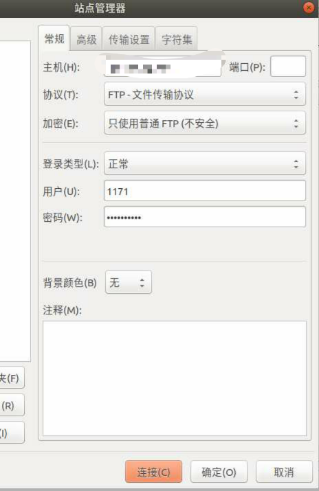

生成一个fpt账户:

	阿里云主机
	用户名：1171
	密码：用户密码

### 目录

	cd /home/ftproot
	mkdir 1171
	lnmp ftp add

生成:

	Enter ftp account name: 1171 (#用户名)
	Enter password for ftp account 1171: (#用户密码)
	Enter directory for ftp account 1171: /home/ftproot/1171 (#ftp根目录)

然后赋予权限组:

	chown www:www -R ./1171

登录截图:

	

文档:

[https://lnmp.org/faq/ftpserver.html](https://lnmp.org/faq/ftpserver.html)
