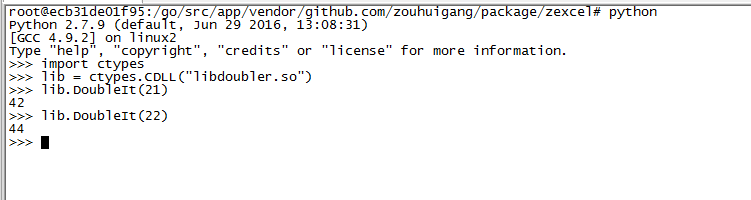

---
#标题
title: "README"
#描述
description: ""
#创建日期
date: 2018-07-24
#修改日期
lastmod: 2018-07-24
#草稿
draft: false
#关键字
keywords: []
#标签
tags: [post,golang-so]
#分类
categories: [post,golang-so]
#作者
author: "邹慧刚"
---
生成so库

目录：

go build -o libdoubler.so -buildmode=c-shared zexcel

单个文件：

go build -o libdoubler.so -buildmode=c-shared main.go

将生成libhello.so  libhello.h文件

### 检测库是否正常

> This puts `libdoubler.so` in your current directory. Let’s check we really have a dynamic shared library:

$ file libdoubler.so 
libdoubler.so: ELF 64-bit LSB shared object, x86-64, version 1 (SYSV), dynamically linked ...

$ nm -D libdoubler.so | grep "T DoubleIt"
000000000005d230 T DoubleIt

### linux下python调用so，win下用会报错

参考文档：

[https://www.darkcoding.net/software/building-shared-libraries-in-go-part-1/](https://www.darkcoding.net/software/building-shared-libraries-in-go-part-1/)

[https://stackoverflow.com/questions/1757090/shared-library-in-go](https://stackoverflow.com/questions/1757090/shared-library-in-go)

[https://www.darkcoding.net/software/building-shared-libraries-in-go-part-2/](https://www.darkcoding.net/software/building-shared-libraries-in-go-part-2/)

