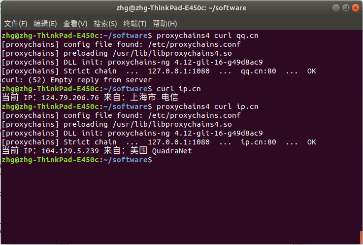

---
#标题
title: "proxychains"
#描述
description: ""
#创建日期
date: 2018-07-24
#修改日期
lastmod: 2018-07-24
#草稿
draft: false
#关键字
keywords: []
#标签
tags: [post,linux]
#分类
categories: [post,linux]
#作者
author: "邹慧刚"
---
### 1.安装

	cd /home/zhg/software/
	git clone https://github.com/rofl0r/proxychains-ng.git
	cd proxychains-ng
	sudo ./configure --prefix=/usr --sysconfdir=/etc
	sudo make && make install
	sudo make install-config
	cd .. && rm -rf proxychains-ng

### 2.编辑proxychains配置

	vi /etc/proxychains.conf
	//将socks4  127.0.0.1 9050改为
	socks5  127.0.0.1 1080  //1080改为你自己的端口

### 3.检查是否成功

	proxychains4 curl ip.cn

显示:

### 问题汇总

Q:
	
	proxychains can't load process....: No such file or directory

A:

	由于curl命令没有安装，找不到curl
	
