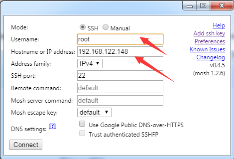

### mosh的安装和使用

#### 服务端安装

	yum -y install epel-release
	yum makecache
	yum -y install mosh

查看版本:

	[root@localhost /]# mosh --version
	mosh 1.3.0 [build mosh 1.3.0]
	Copyright 2012 Keith Winstein <mosh-devel@mit.edu>
	License GPLv3+: GNU GPL version 3 or later <http://gnu.org/licenses/gpl.html>.
	This is free software: you are free to change and redistribute it.
	There is NO WARRANTY, to the extent permitted by law.
	[root@localhost /]# 

### 客户端连接

在chrome浏览器中添加扩展，然后按下图输入服务器ip和用户名即可：

	

