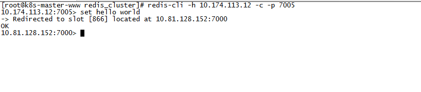

### redis集群的搭建

### 环境(2台服务器)：

	www: 139.196.16.67 (10.174.113.12)
	qa: 47.100.76.132 (10.81.128.152)

这里使用2台服务器

	用两台虚拟机模拟6个节点，一台机器3个节点，创建出3 master、3 salve 环境。

### 安装

	mkdir -p /home/redis && cd /home/redis
	wget http://download.redis.io/releases/redis-4.0.8.tar.gz
	tar xzf redis-4.0.8.tar.gz
	cd redis-4.0.8
	make
	make install

The binaries that are now compiled are available in the src directory. Run Redis with: 

	 src/redis-server

### 按照ruby环境，方便创建集群

	#yum install -y ruby 此方法安装的是ruby 2.0.0 后面会提示版本太低了。最新版安装，参考ruby目录
	yum install rubygems      (ruby包的管理器,用来下载ruby的包)

### 安装ruby包redis.gem
>仅需要在redis-cluster1服务器上安装gem redis (为来redis-trib可以执行)，其他服务器不用。

	gem install redis

查看是否可用,redis-trib.rb  在源码目录 src下:
	
	cd /home/redis/redis-4.0.8/src
	./redis-trib.rb help

help，可以看到redis-trib.rb具有以下功能：

    1、 create ：创建集群
    2、 check ：检查集群
    3、 info ：查看集群信息
    4、 fix ：修复集群
    5、 reshard ：在线迁移slot
    6、 rebalance ：平衡集群节点slot数量
    7、 add-node ：将新节点加入集群
    8、 del-node ：从集群中删除节点
    9、 set-timeout ：设置集群节点间心跳连接的超时时间
    10、 call ：在集群全部节点上执行命令
    11、 import ：将外部redis数据导入集群
	

### 创建集群,创建 Redis 节点

首先在 192.168.31.245 机器上 /home/redis/ 目录下创建 redis_cluster 目录；

	mkdir -p /home/redis/redis_cluster && cd /home/redis/redis_cluster

在 redis_cluster 目录下，创建名为7000、7001、7002的目录，并将 redis.conf 拷贝到这三个目录中

	mkdir 7000 7001 7002

	cp redis.conf redis_cluster/7000
	cp redis.conf redis_cluster/7001
	cp redis.conf redis_cluster/7002　　

分别修改redis.conf的配置文件,redis.conf默认文件在redis安装目录(/home/redis/redis-4.0.8)里面：

	port  7000                                        //端口7000,7002,7003        
	bind  10.81.128.152   //默认ip为127.0.0.1 需要改为其他节点机器可访问的ip 否则创建集群时无法访问对应的端口，无法创建集群
	daemonize    yes       //redis后台运行
	pidfile  /var/run/redis_7000.pid          //pidfile文件对应7000,7001,7002
	cluster-enabled  yes                           //开启集群  把注释#去掉
	cluster-config-file  nodes_7000.conf   //集群的配置  配置文件首次启动自动生成 7000,7001,7002
	cluster-node-timeout  15000                //请求超时  默认15秒，可自行设置
	appendonly  yes                           //aof日志开启  有需要就开启，它会每次写操作都记录一条日志　

### www服务器

	mkdir -p /mnt2/redis && cd /mnt2/redis
	wget http://download.redis.io/releases/redis-4.0.8.tar.gz
	tar xzf redis-4.0.8.tar.gz
	cd redis-4.0.8
	make
	make install

修改配置:

	mkdir -p /mnt2/redis/redis_cluster && cd /mnt2/redis/redis_cluster

	cp redis.conf redis_cluster/7003
	cp redis.conf redis_cluster/7004
	cp redis.conf redis_cluster/7005
	然后批量修改其中的ip和port等信息　　

### 启动集群

	
第一台机器上执行

	redis-server /home/redis/redis_cluster/7000/redis.conf
	redis-server /home/redis/redis_cluster/7001/redis.conf
	redis-server /home/redis/redis_cluster/7002/redis.conf

第二台机器上执行

	redis-server /mnt2/redis/redis_cluster/7003/redis.conf
	redis-server /mnt2/redis/redis_cluster/7004/redis.conf
	redis-server /mnt2/redis/redis_cluster/7005/redis.conf 

### 检查 redis 启动情况

	ps -ef | grep redis
	netstat -tnlp | grep redis

第一台服务器显示：

	[root@k8s-master1 redis]# ps -ef | grep redis
	root      8420     1  0 15:12 ?        00:00:00 redis-server 10.81.128.152:7000 [cluster]
	root      8449     1  0 15:12 ?        00:00:00 redis-server 10.81.128.152:7001 [cluster]
	root      8475     1  0 15:12 ?        00:00:00 redis-server 10.81.128.152:7002 [cluster]
	root     10406  7461  0 15:23 pts/1    00:00:00 grep --color=auto redis
	[root@k8s-master1 redis]# 
	

	[root@k8s-master1 redis]# netstat -tnlp | grep redis
	tcp        0      0 10.81.128.152:7000      0.0.0.0:*               LISTEN      8420/redis-server 1 
	tcp        0      0 10.81.128.152:7001      0.0.0.0:*               LISTEN      8449/redis-server 1 
	tcp        0      0 10.81.128.152:7002      0.0.0.0:*               LISTEN      8475/redis-server 1 
	tcp        0      0 10.81.128.152:17000     0.0.0.0:*               LISTEN      8420/redis-server 1 
	tcp        0      0 10.81.128.152:17001     0.0.0.0:*               LISTEN      8449/redis-server 1 
	tcp        0      0 10.81.128.152:17002     0.0.0.0:*               LISTEN      8475/redis-server 1 
	[root@k8s-master1 redis]# 

第二台服务器显示：

	[root@k8s-master-www redis_cluster]# ps -ef | grep redis
	root      5763     1  0 15:13 ?        00:00:00 redis-server 10.174.113.12:7003 [cluster]
	root      5859     1  0 15:13 ?        00:00:00 redis-server 10.174.113.12:7004 [cluster]
	root      5940     1  0 15:13 ?        00:00:00 redis-server 10.174.113.12:7005 [cluster]
	root     14759 24348  0 15:24 pts/0    00:00:00 grep --color=auto redis
	[root@k8s-master-www redis_cluster]# 

	[root@k8s-master-www redis_cluster]# netstat -tnlp | grep redis
	tcp        0      0 10.174.113.12:17003     0.0.0.0:*               LISTEN      5763/redis-server 1 
	tcp        0      0 10.174.113.12:17004     0.0.0.0:*               LISTEN      5859/redis-server 1 
	tcp        0      0 10.174.113.12:17005     0.0.0.0:*               LISTEN      5940/redis-server 1 
	tcp        0      0 10.174.113.12:7003      0.0.0.0:*               LISTEN      5763/redis-server 1 
	tcp        0      0 10.174.113.12:7004      0.0.0.0:*               LISTEN      5859/redis-server 1 
	tcp        0      0 10.174.113.12:7005      0.0.0.0:*               LISTEN      5940/redis-server 1 
	[root@k8s-master-www redis_cluster]# 

### 创建集群

Redis 官方提供了 redis-trib.rb 这个工具，就在解压目录的 src 目录中，第三步中已将它复制到 /usr/local/bin 目录中，可以直接在命令行中使用了。使用下面这个命令即可完成安装

	cp /home/redis/redis-4.0.8/src/redis-trib.rb /usr/local/bin/　 #第一台服务器
	redis-trib.rb  create  --replicas  1  10.81.128.152:7000  10.81.128.152:7001  10.81.128.152:7002 10.174.113.12:7003  10.174.113.12:7004 10.174.113.12:7005
	

其中，前三个 ip:port 为第一台机器的节点，剩下三个为第二台机器。

选项 --replicas 1 表示我们希望为集群中的每个主节点创建一个从节点,简单来说， 以上命令的意思就是让 redis-trib 程序创建一个包含三个主节点和三个从节点的集群。

启动显示:

	[root@k8s-master1 src]# redis-trib.rb  create  --replicas  1  10.81.128.152:7000  10.81.128.152:7001  10.81.128.152:7002 10.174.113.12:7003  10.174.113.12:7004 10.174.113.12:7005
	>>> Creating cluster
	>>> Performing hash slots allocation on 6 nodes...
	Using 3 masters:
	10.81.128.152:7000
	10.174.113.12:7003
	10.81.128.152:7001
	Adding replica 10.174.113.12:7005 to 10.81.128.152:7000
	Adding replica 10.81.128.152:7002 to 10.174.113.12:7003
	Adding replica 10.174.113.12:7004 to 10.81.128.152:7001
	M: 1de034f10dc64112d17508f9449d6348a009dd5a 10.81.128.152:7000
	   slots:0-5460 (5461 slots) master
	M: 93f83d01aed5ab5e6b0647ce8b32416d4d736130 10.81.128.152:7001
	   slots:10923-16383 (5461 slots) master
	S: 3c6be53c482dfdcc26bad8ee4ac539a25f1b002e 10.81.128.152:7002
	   replicates 751d9dc0c1d758145a885b8c2ad7127d881e13b0
	M: 751d9dc0c1d758145a885b8c2ad7127d881e13b0 10.174.113.12:7003
	   slots:5461-10922 (5462 slots) master
	S: 4409835560b0b56d92bb9266278ea183eb03884f 10.174.113.12:7004
	   replicates 93f83d01aed5ab5e6b0647ce8b32416d4d736130
	S: b00ceb42c0b70d5a1d0a871dbb7d40be84d886c0 10.174.113.12:7005
	   replicates 1de034f10dc64112d17508f9449d6348a009dd5a
	Can I set the above configuration? (type 'yes' to accept): yes

在上面输入yes:

	>>> Nodes configuration updated
	>>> Assign a different config epoch to each node
	>>> Sending CLUSTER MEET messages to join the cluster
	Waiting for the cluster to join.....
	>>> Performing Cluster Check (using node 10.81.128.152:7000)
	M: 1de034f10dc64112d17508f9449d6348a009dd5a 10.81.128.152:7000
	   slots:0-5460 (5461 slots) master
	   1 additional replica(s)
	S: b00ceb42c0b70d5a1d0a871dbb7d40be84d886c0 10.174.113.12:7005
	   slots: (0 slots) slave
	   replicates 1de034f10dc64112d17508f9449d6348a009dd5a
	M: 93f83d01aed5ab5e6b0647ce8b32416d4d736130 10.81.128.152:7001
	   slots:10923-16383 (5461 slots) master
	   1 additional replica(s)
	S: 3c6be53c482dfdcc26bad8ee4ac539a25f1b002e 10.81.128.152:7002
	   slots: (0 slots) slave
	   replicates 751d9dc0c1d758145a885b8c2ad7127d881e13b0
	M: 751d9dc0c1d758145a885b8c2ad7127d881e13b0 10.174.113.12:7003
	   slots:5461-10922 (5462 slots) master
	   1 additional replica(s)
	S: 4409835560b0b56d92bb9266278ea183eb03884f 10.174.113.12:7004
	   slots: (0 slots) slave
	   replicates 93f83d01aed5ab5e6b0647ce8b32416d4d736130
	[OK] All nodes agree about slots configuration.
	>>> Check for open slots...
	>>> Check slots coverage...
	[OK] All 16384 slots covered.
	[root@k8s-master1 src]# 

这表示集群中的 16384 个槽都有至少一个主节点在处理， 集群运作正常

### 集群验证

在第一台机器上连接集群的7002端口的节点，在另外一台连接7005节点，连接方式为 

	redis-cli -h 10.81.128.152 -c -p 7002  

加参数 -C 可连接到集群，因为上面 redis.conf 将 bind 改为了ip地址，所以 -h 参数不可以省略。

说明：-h+host –p+端口号 –c 是要连接集群，注意坑，不加会报错的

另外一台连接7005端口（	在7005节点执行命令）：

	redis-cli -h 10.174.113.12 -c -p 7005 

 	> set hello world

第一台服务器查看刚刚设置的值:

get hello

日志：

	[root@k8s-master1 src]# redis-cli -h 10.81.128.152 -c -p 7002 
	10.81.128.152:7002> get hello
	-> Redirected to slot [866] located at 10.81.128.152:7000
	"world"
	10.81.128.152:7000> get hello
	"world"

set name andy   根据name值会落在7003端口中

get name 会从7003中查询出值

说明集群运作正常。

### 简单说一下原理

redis cluster在设计的时候，就考虑到了去中心化，去中间件，也就是说，集群中的每个节点都是平等的关系，都是对等的，每个节点都保存各自的数据和整个集群的状态。每个节点都和其他所有节点连接，而且这些连接保持活跃，这样就保证了我们只需要连接集群中的任意一个节点，就可以获取到其他节点的数据。

Redis 集群没有并使用传统的一致性哈希来分配数据，而是采用另外一种叫做哈希槽 (hash slot)的方式来分配的。redis cluster 默认分配了 16384 个slot，当我们set一个key 时，会用CRC16算法来取模得到所属的slot，然后将这个key 分到哈希槽区间的节点上，具体算法就是：CRC16(key) % 16384。所以我们在测试的时候看到set 和 get 的时候，直接跳转到了7000端口的节点。

Redis 集群会把数据存在一个 master 节点，然后在这个 master 和其对应的salve 之间进行数据同步。当读取数据时，也根据一致性哈希算法到对应的 master 节点获取数据。只有当一个master 挂掉之后，才会启动一个对应的 salve 节点，充当 master 。

需要注意的是：必须要3个或以上的主节点，否则在创建集群时会失败，并且当存活的主节点数小于总节点数的一半时，整个集群就无法提供服务了。

### 修复集群

官方是推荐使用redis-trib.rb fix 来修复集群…. ….  通过cluster nodes看到7001这个节点被干掉了… 那么 

	redis-trib.rb fix 127.0.0.1:7001 

如果还是启动不了的话，可以把相关的cluster-config-file节点同步信息删掉

增加节点(默认add-node是添加主master节点):

	 redis-trib.rb add-node 127.0.0.1:7006 

增加从节点:

	redis-trib.rb add-node –slave –master-id  'ee05942ee38a56421a07eea01bc6072fe5e23bfd' 127.0.0.1:7008  127.0.0.1:7000

检查节点:

	 redis-trib.rb check 127.0.0.1:7000

删除节点:

	redis-trib.rb del-node 127.0.0.1:7007 

### 其他命令

	[root@k8s-master-www redis_cluster]# redis-cli -h 10.174.113.12 -c -p 7005 
	10.174.113.12:7005> cluster nodes
	b00ceb42c0b70d5a1d0a871dbb7d40be84d886c0 10.174.113.12:7005@17005 myself,slave 1de034f10dc64112d17508f9449d6348a009dd5a 0 1517820001000 6 connected
	93f83d01aed5ab5e6b0647ce8b32416d4d736130 10.81.128.152:7001@17001 master - 0 1517820003274 2 connected 10923-16383
	4409835560b0b56d92bb9266278ea183eb03884f 10.174.113.12:7004@17004 slave 93f83d01aed5ab5e6b0647ce8b32416d4d736130 0 1517820004275 5 connected
	3c6be53c482dfdcc26bad8ee4ac539a25f1b002e 10.81.128.152:7002@17002 slave 751d9dc0c1d758145a885b8c2ad7127d881e13b0 0 1517820003000 4 connected
	1de034f10dc64112d17508f9449d6348a009dd5a 10.81.128.152:7000@17000 master - 0 1517820003000 1 connected 0-5460
	751d9dc0c1d758145a885b8c2ad7127d881e13b0 10.174.113.12:7003@17003 master - 0 1517820001000 4 connected 5461-10922
	10.174.113.12:7005> 

模拟oom

	redis-cli debug oom
 
模拟宕机

	redis-cli -p 7002 debug segfault 
 
模拟hang

	redis-cli -p 6379 DEBUG sleep 30

### 问题汇总

Q1:
	
	/usr/share/rubygems/rubygems/core_ext/kernel_require.rb:55:in `require': cannot load such file -- redis (LoadError)

A1:

	gem install redis

	仅需要在redis-cluster1服务器上安装gem redis (为来redis-trib可以执行)，其他服务器不用。
	如果提示：
	redis requires Ruby version >= 2.2.2.
	则需要更新ruby版本

### 参考文档

[https://www.cnblogs.com/lihaoyang/p/6906444.html](https://www.cnblogs.com/lihaoyang/p/6906444.html)
[http://blog.csdn.net/dream_an/article/details/77199462](http://blog.csdn.net/dream_an/article/details/77199462)

[http://blog.topspeedsnail.com/archives/7274](http://blog.topspeedsnail.com/archives/7274)

[https://www.cnblogs.com/wuxl360/p/5920330.html](https://www.cnblogs.com/wuxl360/p/5920330.html)

[http://redisdoc.com/topic/cluster-tutorial.html](http://redisdoc.com/topic/cluster-tutorial.html)

[http://www.chuodu.com/693.html](http://www.chuodu.com/693.html)

[http://elvis4139.iteye.com/blog/2404696](http://elvis4139.iteye.com/blog/2404696)

[http://xiaorui.cc/2015/05/19/%E4%BD%BF%E7%94%A8redis-trib-fix%E5%91%BD%E4%BB%A4%E4%BF%AE%E5%A4%8Dredis-cluster%E8%8A%82%E7%82%B9/](http://xiaorui.cc/2015/05/19/%E4%BD%BF%E7%94%A8redis-trib-fix%E5%91%BD%E4%BB%A4%E4%BF%AE%E5%A4%8Dredis-cluster%E8%8A%82%E7%82%B9/)

[http://xiaorui.cc/2015/05/16/%e9%80%9a%e8%bf%87redis-trib-rb%e8%84%9a%e6%9c%ac%e6%9e%84%e5%bb%ba%e5%b9%b6%e5%a2%9e%e5%88%a0%e6%94%b9%e6%9f%a5redis-cluster%e9%9b%86%e7%be%a4/](http://xiaorui.cc/2015/05/16/%e9%80%9a%e8%bf%87redis-trib-rb%e8%84%9a%e6%9c%ac%e6%9e%84%e5%bb%ba%e5%b9%b6%e5%a2%9e%e5%88%a0%e6%94%b9%e6%9f%a5redis-cluster%e9%9b%86%e7%be%a4/)

	