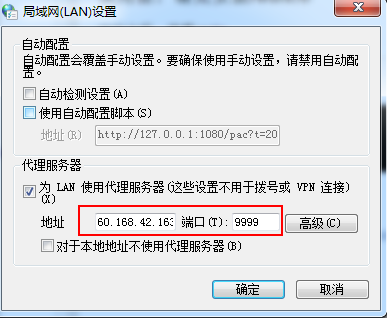
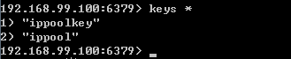

---
#标题
title: "README"
#描述
description: ""
#创建日期
date: 2018-07-24
#修改日期
lastmod: 2018-07-24
#草稿
draft: false
#关键字
keywords: []
#标签
tags: [post,ip pool]
#分类
categories: [post,ip pool]
#作者
author: "邹慧刚"
---
### 代理服务器的好处

	1.可以不断的更换自己的ip地址，隐藏自己的真实地址。
	2.防止封掉爬虫
	3.可以突破一些宽带的限制，有些运营商，如长城移动等运营商，限制一些ip不能访问一些网站。

### windows下设置代理服务器

控制面板->Internet选项->连接->局域网设置->代理服务器

红方框内，分别填入代理服务器的ip和端口地址，即可。通过百度ip查询，代理服务器是否生效。

代理服务器地址获取方式:

	http://www.xicidaili.com/wn/

需要关闭使用自动配置脚本，不然会不生效。

### shadowsocks使用自动配置脚本的设置，是通过c#的SetIEProxy函数实现的。

	 Sysproxy.SetIEProxy(true, true, "127.0.0.1:" + config.localPort.ToString(), null);

其中:config.localPort.ToString()为1080端口

	http://127.0.0.1:1080/pac?t=20180102094011054

 	PacUrl = $"http://127.0.0.1:{config.localPort}/pac?t={GetTimestamp(DateTime.Now)}{PacSecret}";

上面的PacUrl即为使用自动配置脚本的代理地址。

	https://github.com/shadowsocks/shadowsocks-windows/blob/e747805c369a322d06659e528cff7be7682e04f8/shadowsocks-csharp/Controller/System/SystemProxy.cs

	https://github.com/shadowsocks/shadowsocks-windows/blob/a08993519f7ee22696024a178e67df821eea448d/shadowsocks-csharp/Controller/Service/PACServer.cs

### golang版本的shadowsocks

	https://github.com/shadowsocks/shadowsocks-go

### 使用前，请先安装redis库

运行之后，查看redis

	keys *

参考文档:

[http://blog.csdn.net/qq_25504271/article/details/78608725](http://blog.csdn.net/qq_25504271/article/details/78608725)

[http://www.xicidaili.com/wn/](http://www.xicidaili.com/wn/)

[https://github.com/koofr/autoproxy.git](https://github.com/koofr/autoproxy.git)