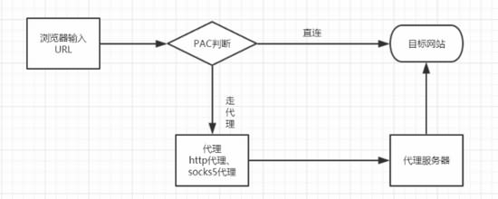
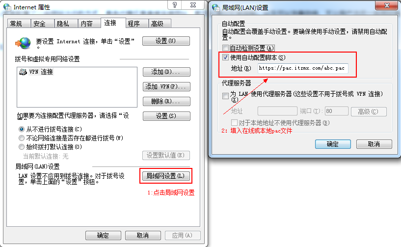

---
#标题
title: "pac文件说明"
#描述
description: ""
#创建日期
date: 2018-07-24
#修改日期
lastmod: 2018-07-24
#草稿
draft: false
#关键字
keywords: []
#标签
tags: [post,pac]
#分类
categories: [post,pac]
#作者
author: "邹慧刚"
---
### pac文件说明

### 什么是PAC

代理自动配置（英语：Proxy auto-config，简称PAC）是一种网页浏览器技术，用于定义浏览器该如何自动选择适当的代理服务器来访问一个网址。

一个PAC文件包含一个JavaScript形式的函数“FindProxyForURL(url, host)”。这个函数返回一个包含一个或多个访问规则的字符串。用户代理根据这些规则适用一个特定的代理其或者直接访问。当一个代理服务器无法响应的时候，多个访问规则提供了其他的后备访问方法。浏览器在访问其他页面以前，首先访问这个PAC文件。PAC文件中的URL可能是手工配置的，也可能是是通过网页的网络代理自发现协议（Web Proxy Autodiscovery Protocol）自动配置的。

简单的讲，PAC就是一种配置，它能让你的浏览器智能判断哪些网站走代理，哪些不需要走代理。用过Shadowsocks的朋友应该会知道， shadowsocks.exe 同级目录下有一个 pac.txt 文件，这正是我们本文刚刚所说的pac配置文件。

### pac优势

PAC自动代理属于智能判断模式，相比全局代理，它的优点有：

    不影响国内网站的访问速度，防止无意义的绕路
    节省Shadowsocks服务的流量，节省服务器资源
    控制方便

例如：

	https://pac.itzmx.com/abc.pac

	帐号：root
	密码：pac.itzmx.com 

### ss的pac文件

	http://127.0.0.1:1080/pac?t=20180103134557730

参考文档：

[http://www.banyuner.com/11407.html](http://www.banyuner.com/11407.html)

[https://www.cnblogs.com/softidea/p/6194596.html](https://www.cnblogs.com/softidea/p/6194596.html)
