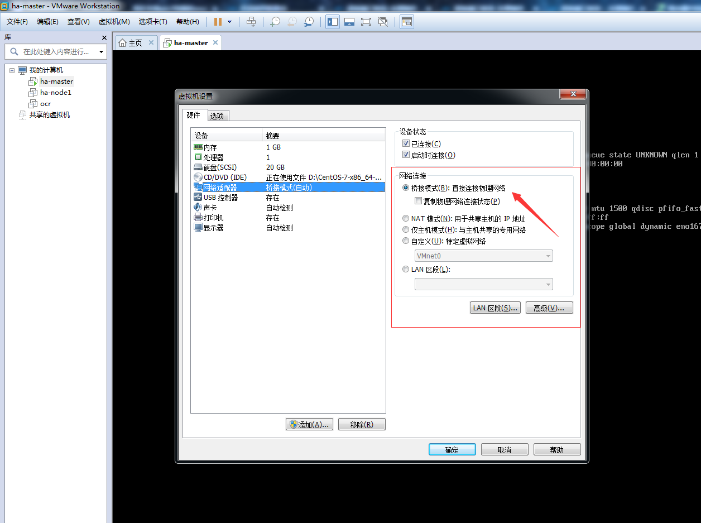
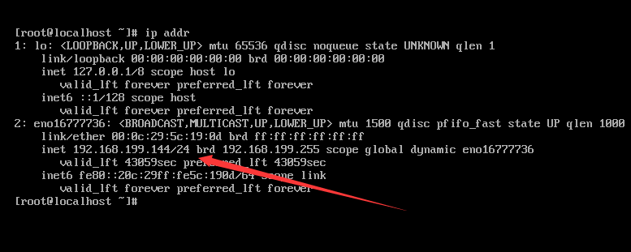
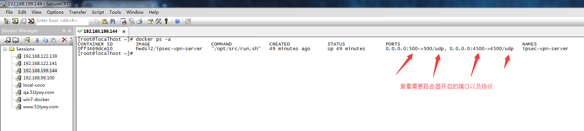
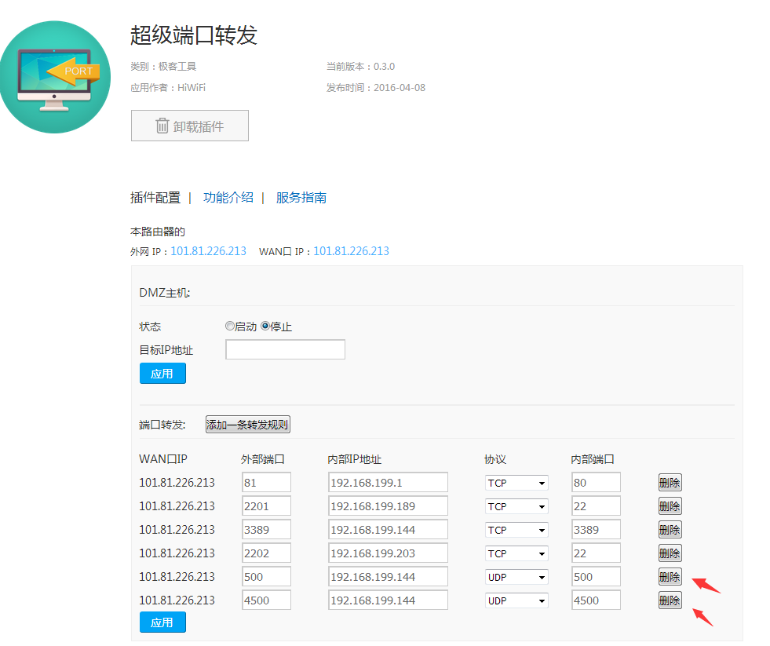
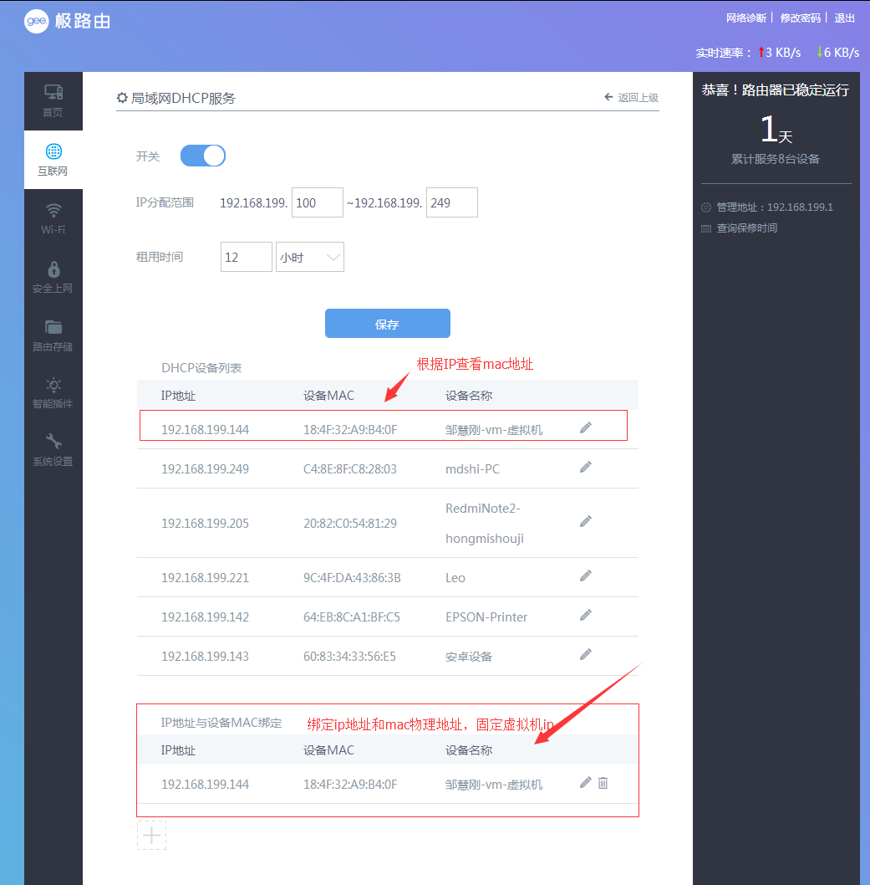
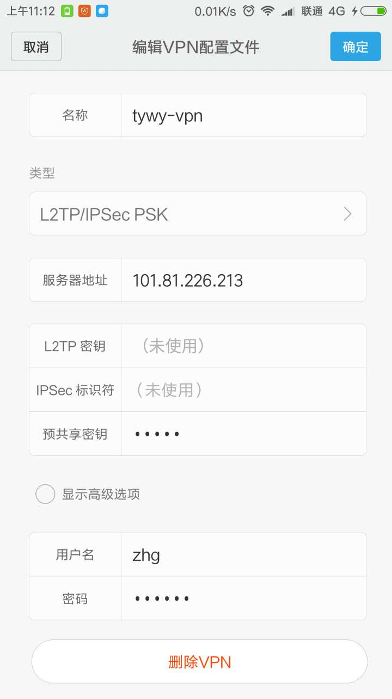

---
#标题
title: "win7+vm"
#描述
description: ""
#创建日期
date: 2018-07-24
#修改日期
lastmod: 2018-07-24
#草稿
draft: false
#关键字
keywords: []
#标签
tags: [post,vpn]
#分类
categories: [post,vpn]
#作者
author: "邹慧刚"
---
### 本地win7+vm虚拟机实现vpn功能

环境：

	在百度打ip出现，本机上网ip地址：101.81.226.213

	虚拟机中的ip地址：192.168.199.144  （可以在路由器中DHCP服务绑定ip，固定虚拟机ip）

### 我的问题：

我在本地win7电脑的vm虚拟机上搭建了一个vpn，为什么手机连不上去？
已经把win7的防火墙关了，用的极路由的没有关闭防火墙的选项，请问要怎样才能成功呢？是要开什么端口么？

### 作者答复：

你好！首先你的vm虚拟机必须使用bridge networking，不能用 NAT。然后需要在你的路由器上设置端口转发 UDP 500 和 UDP 4500 到你的虚拟机的 IP 地址。建议设置路由器的 DHCP 的 MAC 地址绑定，以保证虚拟机的 IP 不变。最后你的 ISP 必须分配一个公有 IP （不是 carrier-grade NAT)。

### 我的操作

#### step1 设置虚拟机桥接模式:

重新连接查看虚拟机ip地址:

为：192.168.199.144

查看需要路由器转发的端口：

#### step2 在路由器上设置端口转发到虚拟机中:

可以看到协议是udp类型，端口号是500和4500

#### step3 固定虚拟机ip地址

### 完成，以上步骤完成之后，手机上连接即可成功，局域网和外网都行！！

验证成功：

参考文档：

[https://github.com/hwdsl2/docker-ipsec-vpn-server/issues/31](https://github.com/hwdsl2/docker-ipsec-vpn-server/issues/31)