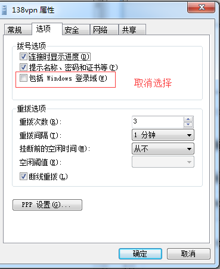
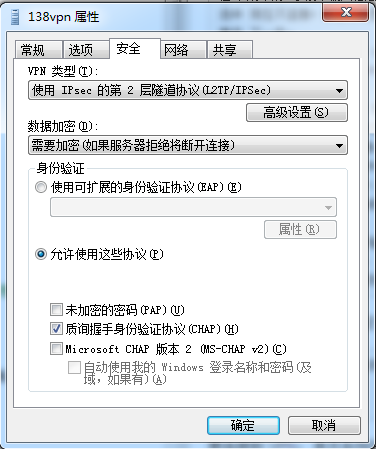
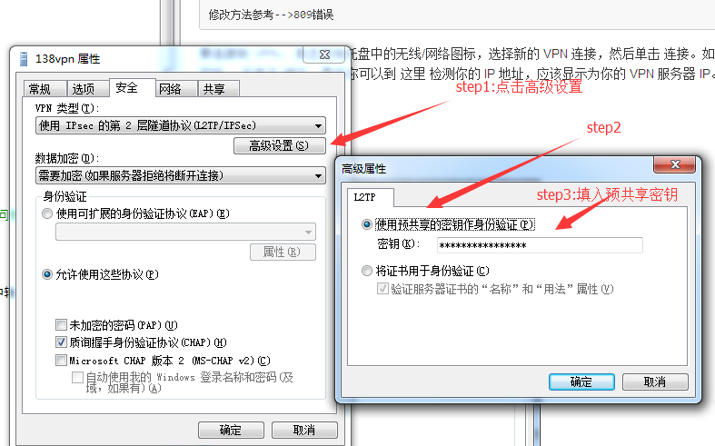
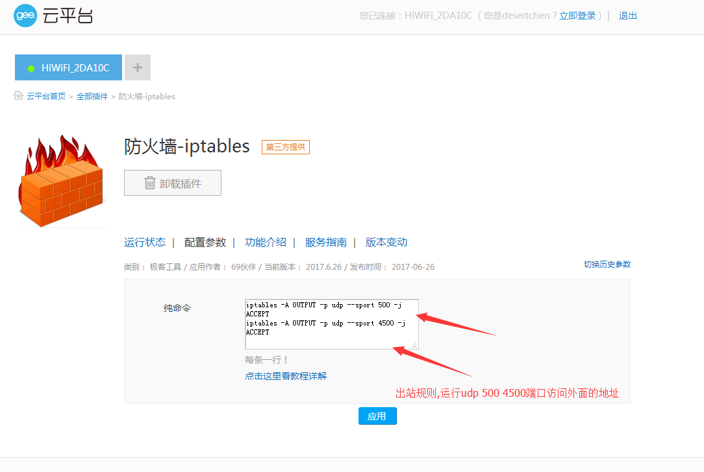

### 之前一直连不上，后面发现，原来是路由器搞的鬼。。在路由器里面设置出站udp协议,500,4500端口就行

	iptables -A OUTPUT -p udp --sport 500 -j ACCEPT
	iptables -A OUTPUT -p udp --sport 4500 -j ACCEPT

### Windows 7, Vista and XP

    单击开始菜单，选择控制面板。
    进入 网络和Internet 部分。
    单击 网络与共享中心。
    单击 设置新的连接或网络。
    选择 连接到工作区，然后单击 下一步。
    单击 使用我的Internet连接 (VPN)。
    在 Internet地址 字段中输入你的 VPN 服务器 IP。
    在 目标名称 字段中输入任意内容。
    选中 现在不连接；仅进行设置以便稍后连接 复选框。
    单击 下一步。
    在 用户名 字段中输入你的 VPN 用户名。
    在 密码 字段中输入你的 VPN 密码。
    选中 记住此密码 复选框。
    单击 创建，然后单击 关闭 按钮。
    返回 网络与共享中心。单击左侧的 更改适配器设置。
    右键单击新创建的 VPN 连接，并选择 属性。
    单击 选项 选项卡，取消选中 包括Windows登录域 复选框。
    单击 安全 选项卡，从 VPN 类型 下拉菜单中选择 "使用 IPsec 的第 2 层隧道协议 (L2TP/IPSec)"。
    单击 允许使用这些协议。确保选中 "质询握手身份验证协议 (CHAP)" 复选框。
    单击 高级设置 按钮。
    单击 使用预共享密钥作身份验证 并在 密钥 字段中输入你的 VPN IPsec PSK。
    单击 确定 关闭 高级设置。
    单击 确定 保存 VPN 连接的详细信息。

修改：数据加密选，不加密

	注： 在首次连接之前需要修改一次注册表，以解决 VPN 服务器 和/或 客户端与 NAT （比如家用路由器）的兼容问题。

	修改方法参考-->809错误

要连接到 VPN： 单击系统托盘中的无线/网络图标，选择新的 VPN 连接，然后单击 连接。如果出现提示，在登录窗口中输入 你的 VPN 用户名 和 密码 ，并单击 确定。最后你可以到 这里 检测你的 IP 地址，应该显示为你的 VPN 服务器 IP。

### vpn连接截图

### step1 :

### 预共享秘钥

## 问题汇总

### 809错误，首次连接需修改注册表

	Windows 错误 809,完成后必须重启计算机

	For Windows Vista, 7, 8, 10, and 2008 Server:

修改注册表,cmd->regedit.exe：

	HKEY_LOCAL_MACHINE\SYSTEM\CurrentControlSet\Services\PolicyAgent 
	
	RegValue: AssumeUDPEncapsulationContextOnSendRule
	
	Type: DWORD
	
	Data Value: 2

方法2，用管理员权限打开cmd：

	REG ADD HKLM\SYSTEM\CurrentControlSet\Services\PolicyAgent /v AssumeUDPEncapsulationContextOnSendRule /t REG_DWORD /d 0x2 /f

重启动！！！！

2、启动服务

Win+R打开“运行”对话框，输入services.msc，打开“服务"（或者在控制面板里搜索“服务”，查看本地服务）

将一下几个服务设为自动：

IPsec Policy Agent

Routing and Remote Access

Remote Access Auto Connection Manager

Remote Access Connection Manager

Secure Socket Tunneling Protocol Service

3、重启计算机，即可使用L2TP。

	

win7死活连不上，猜测可能跟极路由的防火墙有关。

	前几天买了几个月的vpn软件，一遇上极路由死活都连不上，连上也是卡死人的节奏。。。一研究原来是极路由自带的防火墙在搞鬼，更可恨的是这货的防火墙竟然没有一个设置界

后来跑到极路由里面设置vpn,等待了2分钟之后，居然连接成功了,但是，这等于让路由器下面的所有人都能通过vpn上网，这大大增加了vpn的流量了。
最后，在极路由里面找到一个iptables插件，通过设置udp的出站，本机终于能连上vpn啦。

### ipables填写2条出站命令：

	iptables -A OUTPUT -p udp --sport 500 -j ACCEPT
	iptables -A OUTPUT -p udp --sport 4500 -j ACCEPT

在极路由里面添加插件，然后设置：

### 789错误（一般会和809错误冲突，可忽略此错误！！）：
	修改注册表来实现
	
	1. 单击“开始”，单击“运行”，键入“regedit”，然后单击“确定”
	
	2. 找到下面的注册表子项，然后单击它：
	HKEY_LOCAL_MACHINE\
	System\CurrentControlSet\Services\Rasman\Parameters
	
	3. 在“编辑”菜单上，单击“新建”->“DWORD值”
	
	4. 在“名称”框中，键入“ProhibitIpSec”
	
	5. 在“数值数据”框中，键入“1”，然后单击“确定”
	
	6. 退出注册表编辑器，然后重新启动计算机

